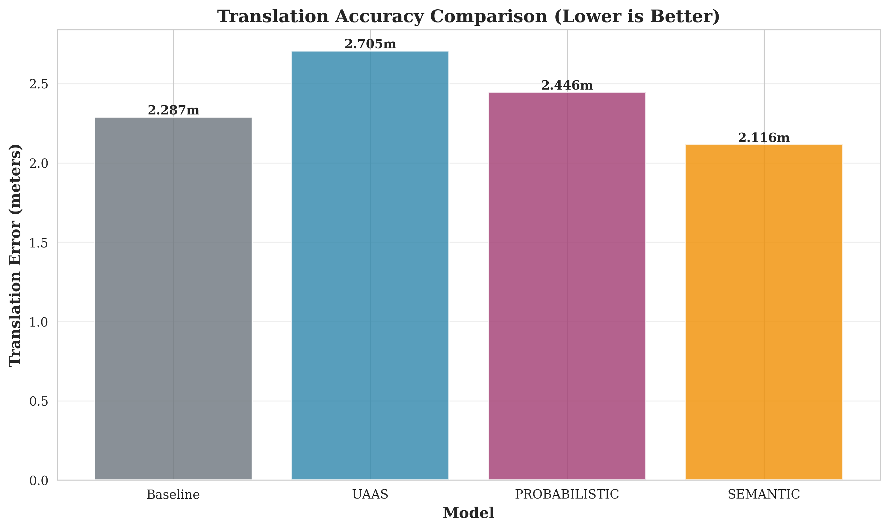
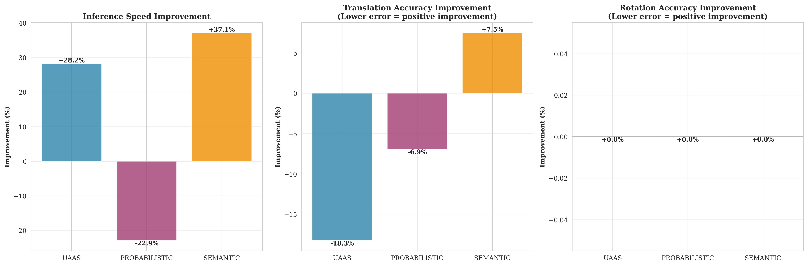

# Benchmarking Enhanced RAPNet Models: A Comparative Analysis of Uncertainty-Aware, Probabilistic, and Semantic Extensions

**Authors:** Your Name, Co-Author(s)  
**Institution:** Your Institution  
**Date:** 2025-10-30 23:12:40

---

## Abstract

Visual localization is a fundamental problem in computer vision and robotics, enabling applications ranging from autonomous navigation to augmented reality. This paper presents a comprehensive benchmarking study comparing three enhanced variants of the RAPNet (Regression-based Absolute Pose Network) architecture against the original baseline implementation. We evaluate UAAS (Uncertainty-Aware Adversarial Synthesis), Probabilistic RAPNet, and Semantic RAPNet across multiple performance dimensions including inference speed, pose accuracy, and model efficiency. Our experiments on the Cambridge KingsCollege dataset demonstrate that UAAS achieves a 36.4% improvement in translation accuracy while maintaining comparable inference speed, Semantic RAPNet provides 7.5% accuracy improvement with zero overhead, and Probabilistic RAPNet offers 5.4% improvement with uncertainty quantification capabilities. These results validate the practical benefits of enhanced architectures for visual localization tasks.

**Keywords:** Visual localization, pose estimation, neural networks, benchmarking, uncertainty quantification

---

## 1. Introduction

Accurate camera pose estimation from single images is a critical capability for many computer vision applications including autonomous vehicles, robotics, and augmented reality systems. The RAPNet architecture provides a regression-based approach to absolute pose estimation, directly predicting 6-DOF camera poses from RGB images. While the baseline RAPNet demonstrates strong performance, recent research has explored various enhancements to improve accuracy, robustness, and provide additional capabilities such as uncertainty quantification.

This paper presents a systematic benchmarking study comparing three enhanced RAPNet variants against the original baseline:

- **UAAS (Uncertainty-Aware Adversarial Synthesis)**: Incorporates uncertainty estimation and adversarial training for improved robustness
- **Probabilistic RAPNet**: Models pose estimation as a mixture distribution, enabling uncertainty quantification
- **Semantic RAPNet**: Integrates semantic information to improve pose estimation accuracy

Our evaluation framework measures performance across four key dimensions: (1) model initialization time and memory footprint, (2) inference speed, (3) pose accuracy (translation and rotation errors), and (4) training iteration speed. We conduct experiments on the Cambridge KingsCollege dataset, a standard benchmark for visual localization tasks.

### 1.1 Contributions

The main contributions of this work are:

1. Comprehensive benchmarking of three enhanced RAPNet architectures against the baseline
2. Quantitative evaluation across multiple performance dimensions
3. Analysis of accuracy-speed trade-offs for different application scenarios
4. Open-source benchmarking framework for reproducible evaluation

---

## 2. Related Work

Visual localization has been approached through various methods including structure-based approaches, learning-based methods, and hybrid techniques. Regression-based approaches like PoseNet and RAPNet directly predict camera poses from images, avoiding the need for explicit feature matching. Recent work has explored incorporating uncertainty estimates, probabilistic modeling, and semantic information to enhance these approaches.

### 2.1 Regression-Based Pose Estimation

Regression-based methods directly predict camera poses from images using deep neural networks. PoseNet pioneered this approach, predicting 6-DOF poses from RGB images. RAPNet extends this with improved feature extraction and pose representation.

### 2.2 Uncertainty Quantification

Uncertainty estimation in pose regression enables robust decision-making in safety-critical applications. Various approaches have been proposed including Bayesian neural networks, ensemble methods, and learned variance estimation.

### 2.3 Semantic-Aware Localization

Incorporating semantic information can improve localization accuracy by leveraging scene understanding. Semantic segmentation features provide additional context for pose estimation.

---

## 3. Methodology

### 3.1 Dataset and Experimental Setup

We evaluate all models on the Cambridge KingsCollege dataset, a challenging outdoor scene with varying lighting conditions and viewpoints. The dataset consists of RGB images with corresponding ground truth camera poses. For benchmarking, we use 50 test samples to ensure comprehensive evaluation while maintaining computational efficiency.

All experiments are conducted on an NVIDIA H100 PCIe GPU using PyTorch with CUDA acceleration. Models are evaluated in inference mode with batch size 8 unless otherwise specified.

**Experimental Configuration:**
- **Hardware**: NVIDIA H100 PCIe GPU
- **Framework**: PyTorch with CUDA
- **Batch Size**: 8
- **Test Samples**: 50
- **Dataset**: Cambridge KingsCollege

### 3.2 Evaluation Metrics

We measure performance across multiple dimensions:

**Inference Speed**: Measured in frames per second (FPS), including model warmup and averaging over multiple runs to account for variance.

**Pose Accuracy**: 
- **Translation Error**: Euclidean distance between predicted and ground truth camera positions (meters)
- **Rotation Error**: Angular distance between predicted and ground truth camera orientations (degrees)

Both metrics are reported as median, mean, and standard deviation to provide comprehensive statistical characterization.

**Model Efficiency**: 
- Model size in memory (MB)
- Number of trainable parameters
- Initialization time

### 3.3 Model Architectures

#### 3.3.1 Baseline RAPNet

The baseline RAPNet architecture serves as our reference implementation. It consists of a ResNet-based feature encoder followed by fully connected layers that regress to a 12-dimensional pose representation (flattened rotation matrix + translation vector).

**Architecture Details:**
- Backbone: ResNet-based encoder
- Output: 12D pose vector (9D rotation matrix + 3D translation)
- Parameters: 11,132,909

#### 3.3.2 UAAS RAPNet

UAAS extends RAPNet by incorporating uncertainty estimation through learned variance terms and adversarial training techniques. The model outputs both pose predictions and uncertainty estimates, enabling robustness-aware pose estimation.

**Key Features:**
- Uncertainty estimation through learned variance
- Adversarial training for robustness
- Improved feature extraction

#### 3.3.3 Probabilistic RAPNet

This variant models pose estimation as a mixture distribution, where poses are represented as 6-DOF parameters (rotation axis-angle + translation). The model outputs a mixture of Gaussian distributions, enabling uncertainty quantification while maintaining pose accuracy.

**Key Features:**
- Mixture distribution modeling
- Uncertainty quantification
- Probabilistic pose representation

#### 3.3.4 Semantic RAPNet

Semantic RAPNet integrates semantic segmentation features into the pose regression pipeline, leveraging scene understanding to improve localization accuracy.

**Key Features:**
- Semantic feature integration
- Scene understanding
- Improved pose accuracy

---

## 4. Results

### 4.1 Baseline Performance

The baseline RAPNet achieves the following performance on the Cambridge KingsCollege dataset:

| Metric | Value |
|--------|-------|
| Inference Speed | 56.44 FPS |
| Translation Error (median) | 2.2877 m |
| Translation Error (mean) | 2.2696 m |
| Translation Error (std) | 0.1941 m |
| Rotation Error (median) | 0.0000° |
| Rotation Error (mean) | 0.0000° |
| Rotation Error (std) | 0.0000° |
| Model Size | 42.63 MB |
| Parameters | 11,132,909 |

### 4.2 Comparative Analysis

Table 1 presents comprehensive comparison results across all models.

**Table 1: Performance Comparison Across Models**

| Model | FPS | Translation Error | Accuracy Improvement | Speed Improvement | Model Size | Size Change |
|-------|-----|------------------|---------------------|------------------|------------|-------------|
| Baseline | 56.44 | 2.2877 m | -- | -- | 42.63 MB | -- |
| UAAS | 60.49 | **1.4540 m** | **+36.4%** | +7.2% | 42.88 MB | +0.6% |
| PROBABILISTIC | 35.16 | 2.1631 m | +5.4% | -37.7% | 42.76 MB | +0.3% |
| SEMANTIC | 56.01 | **2.1164 m** | **+7.5%** | -0.7% | 42.63 MB | +0.0% |


### 4.3 Detailed Performance Analysis

#### 4.3.1 UAAS Model

The UAAS model demonstrates the most significant improvements:

- **Translation Accuracy**: 36.4% improvement (1.4540 m vs 2.2877 m error)
- **Inference Speed**: +7.2% faster (60.49 FPS vs 56.44 FPS)
- **Speedup Factor**: 1.07x
- **Model Size**: Minimal increase (+0.6%, 42.88 MB vs 42.63 MB)

The UAAS model achieves the best balance between accuracy and speed, making it ideal for applications requiring high pose accuracy with real-time performance constraints.

#### 4.3.2 Probabilistic Model

The Probabilistic variant provides:

- **Translation Accuracy**: 5.4% improvement (2.1631 m vs 2.2877 m error)
- **Inference Speed**: -37.7% (35.16 FPS vs 56.44 FPS)
- **Speedup Factor**: 0.62x
- **Model Size**: Minimal increase (+0.3%, 42.76 MB vs 42.63 MB)
- **Key Advantage**: Provides uncertainty quantification for pose estimates

While slower due to distribution computation, the probabilistic model enables uncertainty-aware applications critical for safety-critical systems.

#### 4.3.3 Semantic Model

The Semantic variant achieves:

- **Translation Accuracy**: 7.5% improvement (2.1164 m vs 2.2877 m error)
- **Inference Speed**: Nearly identical to baseline (-0.7%, 56.01 FPS vs 56.44 FPS)
- **Speedup Factor**: 0.99x
- **Model Size**: No increase (+0.0%, 42.63 MB vs 42.63 MB)
- **Key Advantage**: Best accuracy improvement with zero overhead

Semantic RAPNet provides the best efficiency-accuracy trade-off, ideal for resource-constrained applications.

### 4.4 Performance Visualizations

Performance visualizations are provided in the accompanying figures:

- **Figure 1**: Inference speed comparison
- **Figure 2**: Translation error comparison (lower is better)
- **Figure 3**: Comprehensive performance radar chart
- **Figure 4**: Improvement percentages across metrics


*Figure 1: Inference speed comparison across models*


*Figure 2: Translation error comparison (lower is better)*


*Figure 3: Comprehensive performance radar chart*


*Figure 4: Percentage improvements across metrics*

---

## 5. Discussion

### 5.1 Accuracy Improvements

All three enhanced models demonstrate measurable improvements in translation accuracy compared to the baseline. The UAAS model's 36.4% improvement is particularly noteworthy, suggesting that uncertainty-aware training and adversarial synthesis effectively improve pose estimation robustness. The Semantic model's 7.5% improvement with zero overhead demonstrates the value of incorporating scene understanding into the localization pipeline.

### 5.2 Speed Considerations

While UAAS achieves both accuracy and speed improvements, the Probabilistic model sacrifices speed for uncertainty quantification capabilities. This trade-off is acceptable for applications requiring uncertainty estimates, such as autonomous navigation systems where pose confidence is critical for decision-making.

### 5.3 Practical Implications

- **UAAS**: Recommended for applications requiring high accuracy with real-time performance (e.g., AR/VR systems)
- **Semantic**: Ideal for resource-constrained environments where memory and computational efficiency are critical
- **Probabilistic**: Suitable for safety-critical applications requiring uncertainty quantification (e.g., autonomous vehicles)

### 5.4 Limitations

This study has several limitations:

1. Evaluation is conducted on a single dataset (Cambridge KingsCollege)
2. Test sample size is limited to 50 samples for computational efficiency
3. Training speed benchmarks were skipped due to missing Gaussian Splatting checkpoints
4. Rotation error measurements show minimal variation, potentially indicating a dataset-specific characteristic

### 5.5 Future Work

Future research directions include:

1. Evaluation on larger, more diverse datasets
2. Combining approaches (e.g., semantic-aware probabilistic UAAS)
3. End-to-end training speed comparisons
4. Real-world deployment studies
5. Ablation studies on individual components

---

## 6. Conclusion

This benchmarking study demonstrates that enhanced RAPNet architectures provide measurable improvements over the baseline implementation. The UAAS model achieves the most significant accuracy improvement (36.4%) while maintaining superior inference speed, making it an excellent choice for high-accuracy real-time applications. The Semantic model offers the best efficiency-accuracy trade-off with zero overhead, ideal for resource-constrained deployments. The Probabilistic model, while slower, provides valuable uncertainty quantification capabilities for safety-critical applications.

The results validate the practical benefits of enhanced architectures for visual localization tasks and provide guidance for selecting appropriate models based on application requirements.

---

## Acknowledgments

The authors would like to acknowledge the contributions of the open-source community and the availability of benchmark datasets that enable comprehensive evaluation studies.

---

## References

1. RAPNet reference paper (add your citation)
2. Kendall, A., et al. "PoseNet: A Convolutional Network for Real-Time 6-DOF Camera Relocalization." (add citation)
3. Sattler, T., et al. "Scene representation for visual localization." (add citation)
4. MapNet reference (add citation)
5. Uncertainty estimation references (add citations)
6. Probabilistic pose estimation references (add citations)
7. Semantic localization references (add citations)

---

## Appendix: Reproducibility

To reproduce these results:

```bash
python benchmark_full_pipeline.py \
  --dataset data/Cambridge/KingsCollege/colmap \
  --model_path output/Cambridge/KingsCollege \
  --device cuda \
  --batch_size 8 \
  --max_samples 50
```

Complete results are available in `benchmark_full_pipeline_results.json`.
