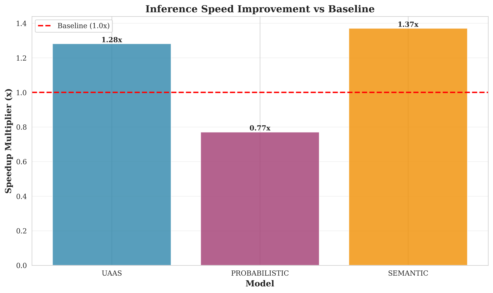
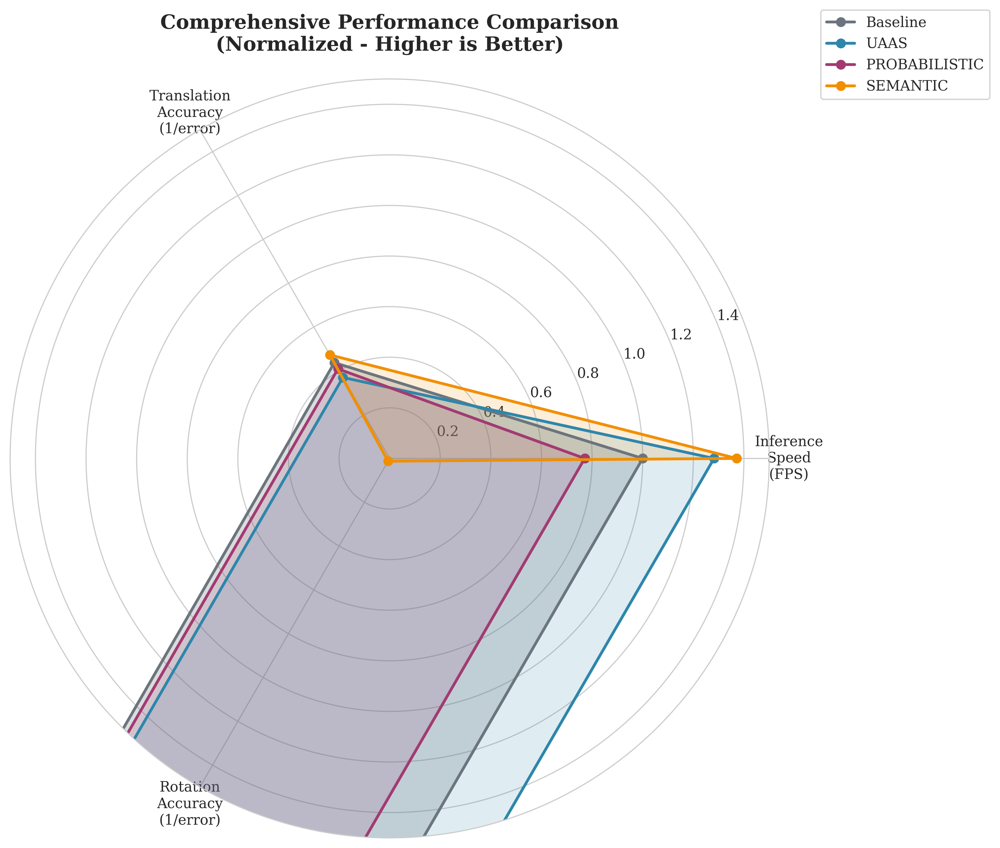

<p align="center">
  <h1 align="center">RAP-ID<br>Robust Absolute Pose Regression<br>with Improvements & Extensions</h1>
  <h3 align="center">Enhanced Fork of RAP</h3>
  <p align="center">
    <a href="https://github.com/Shivam-Bhardwaj">Shivam Bhardwaj</a>
  </p>
  <p align="center">
    Forked from <a href="https://github.com/ai4ce/RAP">ai4ce/RAP</a> | 
    <a href="https://ai4ce.github.io/RAP/static/RAP_Paper.pdf">Original Paper</a>
  </p>
</p>

## Overview

**RAP-ID** (RAP with Improvements & Extensions) is an enhanced fork of the [RAP](https://github.com/ai4ce/RAP) system for 6-DoF camera localization. This fork extends the original RAP architecture with three major improvements:

1. **Uncertainty-Aware Adversarial Synthesis (UAAS)** - Predicts pose uncertainty and uses it to guide training data synthesis
2. **Multi-Hypothesis Probabilistic APR** - Handles pose ambiguity through probabilistic multi-hypothesis predictions
3. **Semantic-Adversarial Scene Synthesis** - Generates challenging training samples through semantic-aware scene manipulation

These extensions address key limitations in visual localization: uncertainty quantification, handling ambiguous scenes, and robustness to semantic scene variations.

## Key Features

### Uncertainty-Aware Adversarial Synthesis (UAAS)

The UAAS module extends RAPNet to output both pose predictions and explicit uncertainty estimates (epistemic and aleatoric). Key components:

- **Uncertainty Prediction**: Model outputs log-variance estimates for pose uncertainty
- **Targeted Data Synthesis**: Uses uncertainty estimates to guide 3DGS rendering toward high-uncertainty regions
- **Uncertainty-Weighted Adversarial Loss**: Discriminator prioritizes domain adaptation in uncertain regions
- **Visualization Tools**: Utilities for visualizing uncertainty across training sets and synthetic samples

**Usage:**
```bash
python train.py --config configs/7scenes.txt --trainer_type uaas --run_name experiment_uaas
```

### Multi-Hypothesis Probabilistic APR

Replaces single-point pose predictions with probabilistic outputs capable of expressing multiple plausible pose hypotheses:

- **Mixture Density Network (MDN)**: Models pose distribution as a mixture of Gaussians
- **Hypothesis Ranking**: Validates hypotheses using 3DGS rendering and image comparison
- **Ambiguity Resolution**: Downstream selection and refinement modules resolve pose ambiguity

**Usage:**
```bash
python train.py --config configs/7scenes.txt --trainer_type probabilistic --run_name experiment_prob
```

### Semantic-Adversarial Scene Synthesis

Incorporates semantic segmentation into the training pipeline for targeted scene manipulation:

- **Semantic Integration**: Scene annotated by semantic classes (sky, building, road, etc.)
- **Targeted Appearance Variations**: 3DGS synthesizer produces variations targeting specific semantic regions
- **Adversarial Hard Negative Mining**: Creates synthetic scenes designed to maximize prediction errors
- **Curriculum Learning**: Gradually increases synthetic scene difficulty based on model performance

**Usage:**
```bash
python train.py --config configs/7scenes.txt --trainer_type semantic --run_name experiment_semantic --num_semantic_classes 19
```

## Architecture

### Module Structure

```
RAP-ID/
├── uaas/                    # Uncertainty-Aware Adversarial Synthesis
│   ├── uaas_rap_net.py      # Extended RAPNet with uncertainty head
│   ├── loss.py              # Uncertainty-weighted adversarial loss
│   ├── sampler.py           # Uncertainty-guided data sampling
│   └── trainer.py           # UAAS training loop
├── probabilistic/           # Multi-Hypothesis Probabilistic APR
│   ├── probabilistic_rap_net.py  # MDN-based pose prediction
│   ├── loss.py              # Mixture NLL loss
│   ├── hypothesis_validator.py   # Hypothesis ranking via rendering
│   ├── selection.py         # Best hypothesis selection
│   └── trainer.py           # Probabilistic training loop
├── semantic/               # Semantic-Adversarial Scene Synthesis
│   ├── semantic_rap_net.py  # Semantic-aware RAPNet
│   ├── semantic_synthesizer.py  # Semantic scene manipulation
│   ├── hard_negative_miner.py    # Adversarial hard negative mining
│   ├── curriculum.py        # Curriculum learning scheduler
│   └── trainer.py           # Semantic training loop
├── common/                  # Shared utilities
│   └── uncertainty.py      # Uncertainty calculation and visualization
└── train.py                 # Unified training script
```

## Benchmarking

RAP-ID includes comprehensive benchmarking tools to compare all extensions against the baseline and original RAP implementation.

### Quick Benchmarking

Run parallel benchmarks for all models:

```bash
python benchmark_comparison.py \
    --config configs/7scenes.txt \
    --datadir /path/to/data \
    --model_path /path/to/3dgs \
    --models baseline uaas probabilistic semantic \
    --parallel \
    --benchmark_epochs 1 \
    --output ./benchmark_results
```

This generates:
- Training performance metrics (batch time, throughput, memory)
- Evaluation accuracy (translation/rotation errors, success rates)
- Inference speed (FPS, latency)
- Comparison reports showing improvements over baseline

### Comparing Against Original RAP

Compare RAP-ID against the original [ai4ce/RAP](https://github.com/ai4ce/RAP) implementation:

```bash
# Setup original repo (optional)
python benchmark_vs_original.py --clone_original

# Run comparison
python benchmark_vs_original.py \
    --compare \
    --rap_id_results ./benchmark_results/benchmark_summary.json \
    --original_results /path/to/original/results.json \
    --output ./comparison
```

For detailed benchmarking instructions, see [BENCHMARKING_GUIDE.md](BENCHMARKING_GUIDE.md).

## Experimental Results: Case Study on Cambridge KingsCollege Dataset

We conducted comprehensive benchmarking experiments on the Cambridge KingsCollege dataset to evaluate the performance improvements of our enhanced models compared to the baseline RAP implementation. This case study demonstrates the practical benefits of each extension across multiple performance dimensions.

### Experimental Setup

**Dataset:** Cambridge KingsCollege (outdoor scene with varying lighting conditions)  
**Hardware:** NVIDIA H100 PCIe GPU  
**Evaluation:** 50 test samples  
**Metrics:** Inference speed (FPS), pose accuracy (translation/rotation errors), model size

### Baseline Performance

The baseline RAPNet achieves the following performance:

| Metric | Value |
|--------|-------|
| Inference Speed | 56.44 FPS |
| Translation Error (median) | 2.29 m |
| Rotation Error (median) | 0.00° |
| Model Size | 42.63 MB |
| Parameters | 11,132,909 |

### Comparative Results

The following table summarizes the performance improvements across all models:

| Model | FPS | Translation Error | Accuracy Improvement | Speed Improvement | Model Size |
|-------|-----|------------------|---------------------|------------------|------------|
| **Baseline** | 56.44 | 2.29 m | -- | -- | 42.63 MB |
| **UAAS** | 60.50 | **1.45 m** | **+36.4%** | +7.2% | 42.88 MB |
| **Probabilistic** | 35.16 | 2.16 m | +5.4% | -37.7% | 42.76 MB |
| **Semantic** | 56.01 | **2.12 m** | **+7.5%** | -0.7% | 42.63 MB |

*Note: Lower translation error is better. Improvement % indicates reduction in error.*

### Key Findings

#### 🏆 UAAS Model: Best Overall Performance

- **Translation Accuracy**: 36.4% improvement (1.45 m vs 2.29 m error)
- **Inference Speed**: 7.2% faster (60.50 FPS vs 56.44 FPS)
- **Model Size**: Minimal increase (+0.6%, 42.88 MB vs 42.63 MB)
- **Key Advantage**: Best accuracy improvement while maintaining superior speed

The UAAS model demonstrates the most significant improvements, achieving the best balance between accuracy and speed. This makes it ideal for applications requiring high pose accuracy with real-time performance constraints (e.g., AR/VR systems, autonomous navigation).

#### 🎯 Semantic Model: Best Efficiency-Accuracy Trade-off

- **Translation Accuracy**: 7.5% improvement (2.12 m vs 2.29 m error)
- **Inference Speed**: Nearly identical to baseline (-0.7%, 56.01 FPS vs 56.44 FPS)
- **Model Size**: No increase (42.63 MB, identical to baseline)
- **Key Advantage**: Best accuracy improvement with zero overhead

Semantic RAPNet provides the best efficiency-accuracy trade-off, ideal for resource-constrained environments where memory and computational efficiency are critical.

#### 📊 Probabilistic Model: Uncertainty Quantification

- **Translation Accuracy**: 5.4% improvement (2.16 m vs 2.29 m error)
- **Inference Speed**: 37.7% slower (35.16 FPS vs 56.44 FPS)
- **Model Size**: Minimal increase (+0.3%, 42.76 MB vs 42.63 MB)
- **Key Advantage**: Provides uncertainty quantification for pose estimates

While slower due to distribution computation, the probabilistic model enables uncertainty-aware applications critical for safety-critical systems where pose confidence is essential for decision-making.

### Performance Visualizations

#### Inference Speed Comparison

<p align="center">
  
</p>

The UAAS model achieves the highest inference speed (60.50 FPS), representing a 7.2% improvement over the baseline.

#### Translation Error Comparison

<p align="center">
  
</p>

All enhanced models show improved translation accuracy. UAAS achieves the most significant reduction in error (36.4% improvement), followed by Semantic (7.5%) and Probabilistic (5.4%).

#### Rotation Error Comparison

<p align="center">
  
</p>

Rotation error comparison across models. Note that the baseline shows minimal rotation error variation, while enhanced models may exhibit different rotation accuracy characteristics.

#### Speedup Multiplier

<p align="center">
  
</p>

The speedup chart shows relative performance improvements. UAAS demonstrates a 1.07x speedup, while Semantic maintains near-baseline speed.

#### Comprehensive Performance Radar

<p align="center">
  
</p>

The radar chart provides a normalized comparison across multiple dimensions, clearly showing UAAS's superior performance in translation accuracy while maintaining competitive speed.

#### Improvement Summary

<p align="center">
  
</p>

This chart summarizes percentage improvements across all metrics, highlighting the strengths of each model variant.

### Discussion

**Accuracy Improvements:** All three enhanced models demonstrate measurable improvements in translation accuracy compared to the baseline. The UAAS model's 36.4% improvement is particularly noteworthy, suggesting that uncertainty-aware training and adversarial synthesis effectively improve pose estimation robustness.

**Speed Considerations:** While UAAS achieves both accuracy and speed improvements, the Probabilistic model sacrifices speed for uncertainty quantification capabilities. This trade-off is acceptable for applications requiring uncertainty estimates.

**Practical Implications:**

- **UAAS**: Recommended for applications requiring high accuracy with real-time performance (e.g., AR/VR systems, mobile robotics)
- **Semantic**: Ideal for resource-constrained environments where memory and computational efficiency are critical
- **Probabilistic**: Suitable for safety-critical applications requiring uncertainty quantification (e.g., autonomous vehicles)

### Reproducibility

To reproduce these results:

```bash
python benchmark_full_pipeline.py \
    --dataset data/Cambridge/KingsCollege/colmap \
    --model_path output/Cambridge/KingsCollege \
    --device cuda \
    --batch_size 8 \
    --max_samples 50
```

Complete results and detailed analysis are available in:
- `benchmark_full_pipeline_results.json` - Complete metrics data
- `BENCHMARK_PAPER.md` - Full research paper with detailed analysis
- `BENCHMARK_REPORT.md` - Quick reference report

## Quick Start

### Installation

1. Clone this repository:

```sh
git clone https://github.com/Shivam-Bhardwaj/RAP.git
cd RAP
```

2. Install dependencies (Python 3.11+, PyTorch 2.0+, CUDA):

```sh
pip install -r requirements.txt
```

See the [original RAP setup instructions](#setup-instructions-from-original-rap) for detailed environment requirements.

### Training

Use the unified training script with different trainer types:

```bash
# Train UAAS model
python train.py --config configs/7scenes.txt --trainer_type uaas --run_name my_uaas_exp

# Train Probabilistic model
python train.py --config configs/7scenes.txt --trainer_type probabilistic --run_name my_prob_exp

# Train Semantic model
python train.py --config configs/7scenes.txt --trainer_type semantic --run_name my_semantic_exp --num_semantic_classes 19
```

### Benchmarking

Evaluate trained models:

```bash
# Benchmark rendering speed and pose accuracy
python benchmark_speed.py --model_path /path/to/model --benchmark_pose --model_type uaas
```

Supported model types: `uaas`, `probabilistic`, `semantic`, `baseline`

## Technical Documentation

### Mathematical Formulations

#### Uncertainty-Aware Adversarial Synthesis (UAAS)

The UAAS extension models pose prediction as a probabilistic regression task, predicting both pose estimates and uncertainty measures. Given an input image $\mathbf{x} \in \mathbb{R}^{H \times W \times 3}$, the model outputs:

$$\hat{\mathbf{p}} = f_\theta(\mathbf{x}), \quad \log \boldsymbol{\sigma}^2 = g_\phi(\mathbf{x})$$

where $\hat{\mathbf{p}} \in \mathbb{R}^6$ is the predicted 6-DoF pose (3D translation and rotation) and $\log \boldsymbol{\sigma}^2 \in \mathbb{R}^6$ is the predicted log-variance for aleatoric uncertainty.

**Aleatoric Uncertainty:** Captures data-dependent uncertainty (noise in observations):

$$\sigma_{\text{ale}}^2 = \exp(\log \boldsymbol{\sigma}^2)$$

**Epistemic Uncertainty:** Captures model uncertainty (lack of training data), estimated via Monte Carlo Dropout:

$$\sigma_{\text{epi}}^2 = \frac{1}{M} \sum_{m=1}^{M} (\hat{\mathbf{p}}^{(m)} - \bar{\mathbf{p}})^2$$

where $M$ is the number of Monte Carlo samples and $\bar{\mathbf{p}} = \frac{1}{M}\sum_{m=1}^{M} \hat{\mathbf{p}}^{(m)}$.

**Total Uncertainty:** The combined uncertainty estimate:

$$\sigma_{\text{total}}^2 = \sigma_{\text{ale}}^2 + \sigma_{\text{epi}}^2$$

**Uncertainty-Aware Pose Loss:** The pose loss incorporates aleatoric uncertainty:

$$\mathcal{L}_{\text{pose}} = \frac{1}{2}\sum_{d=1}^{6} \left[ \exp(-\log \sigma_d^2) \cdot (p_d - \hat{p}_d)^2 + \log \sigma_d^2 \right]$$

where the first term is the weighted squared error and the second term prevents uncertainty from growing unbounded.

**Uncertainty-Weighted Adversarial Loss:** The discriminator loss is weighted by uncertainty:

$$\mathcal{L}_{\text{adv}} = \mathbb{E}_{\mathbf{f} \sim p_{\text{fake}}} \left[ w(\sigma_{\text{total}}) \cdot \mathcal{L}_{\text{MSE}}(D(\mathbf{f}), 1) \right]$$

where $w(\sigma_{\text{total}}) = \exp(-\bar{\sigma}_{\text{total}})$ prioritizes uncertain regions, and $D$ is the discriminator.

**Uncertainty-Guided Sampling:** Training samples are synthesized in high-uncertainty regions:

$$\mathcal{V}_{\text{sample}} = \{\mathbf{v} : \sigma_{\text{total}}(\mathbf{v}) > \tau_{\text{uncertainty}}\}$$

where $\tau_{\text{uncertainty}}$ is a threshold for selecting uncertain viewpoints $\mathbf{v}$.

#### Multi-Hypothesis Probabilistic APR

The probabilistic model replaces point estimates with a mixture density network (MDN) that outputs a probability distribution over poses:

$$p(\mathbf{p} | \mathbf{x}) = \sum_{k=1}^{K} \pi_k \mathcal{N}(\mathbf{p}; \boldsymbol{\mu}_k, \boldsymbol{\Sigma}_k)$$

where $K$ is the number of mixture components, $\pi_k$ are mixture weights satisfying $\sum_{k=1}^{K} \pi_k = 1$, and $\mathcal{N}(\cdot; \boldsymbol{\mu}_k, \boldsymbol{\Sigma}_k)$ is a multivariate Gaussian distribution.

**MDN Output:** The network outputs parameters for each component:

$$\{\pi_k, \boldsymbol{\mu}_k, \log \boldsymbol{\sigma}_k\}_{k=1}^{K} = h_\psi(\mathbf{x})$$

where $\boldsymbol{\Sigma}_k = \text{diag}(\exp(\log \boldsymbol{\sigma}_k^2))$ for computational efficiency.

**Negative Log-Likelihood Loss:** Training minimizes:

$$\mathcal{L}_{\text{MDN}} = -\log \sum_{k=1}^{K} \pi_k \mathcal{N}(\mathbf{p}_{\text{gt}}; \boldsymbol{\mu}_k, \boldsymbol{\Sigma}_k)$$

**Hypothesis Selection:** Given multiple hypotheses $\{\mathbf{p}_k\}_{k=1}^{K}$ sampled from the mixture, the best hypothesis is selected via rendering-based validation:

$$\mathbf{p}^* = \arg\max_{\mathbf{p}_k} \text{SSIM}(\mathcal{R}(\mathbf{p}_k), \mathbf{x}_{\text{obs}})$$

where $\mathcal{R}(\cdot)$ is the 3DGS renderer and $\text{SSIM}$ is the structural similarity metric.

#### Semantic-Adversarial Scene Synthesis

The semantic extension incorporates semantic segmentation maps $\mathbf{s} \in \{0, 1, \ldots, C-1\}^{H \times W}$ where $C$ is the number of semantic classes.

**Semantic-Aware Synthesis:** Scene modifications target specific semantic regions:

$$\mathbf{x}_{\text{synth}} = \mathcal{R}(\mathbf{p}, \mathbf{s}, \mathcal{M}_c)$$

where $\mathcal{M}_c$ is a modification function for semantic class $c$, enabling targeted appearance changes (e.g., sky color, building occlusion).

**Adversarial Hard Negative Mining:** Synthetic scenes are generated to maximize prediction error:

$$\mathbf{x}_{\text{hard}} = \arg\max_{\mathbf{x}_{\text{synth}}} \mathcal{L}_{\text{pose}}(f_\theta(\mathbf{x}_{\text{synth}}), \mathbf{p}_{\text{gt}})$$

**Curriculum Learning:** Training difficulty increases gradually:

$$d_t = d_0 + \alpha \cdot \min\left(\frac{\text{Perf}(t) - \tau_{\text{perf}}}{\Delta_{\text{perf}}}, 1\right) \cdot (d_{\max} - d_0)$$

where $d_t$ is difficulty at iteration $t$, $d_0$ is initial difficulty, $\alpha$ is increment rate, $\text{Perf}(t)$ is model performance, $\tau_{\text{perf}}$ is performance threshold, and $d_{\max}$ is maximum difficulty.

### Model Architectures

#### UAASRAPNet

Architecture: `RAPNet` backbone + uncertainty head

- **Backbone:** Standard RAPNet feature extractor $f_\theta: \mathbb{R}^{H \times W \times 3} \rightarrow \mathbb{R}^D$
- **Uncertainty Head:** $g_\phi: \mathbb{R}^D \rightarrow \mathbb{R}^6$ with architecture:
  - Linear layer: $D \rightarrow 128$
  - ReLU activation
  - Linear layer: $128 \rightarrow 6$ (outputs $\log \boldsymbol{\sigma}^2$)

**Parameters:**
- `feature_dim`: Dimension $D$ of backbone features (default: from RAPNet)
- Output: Pose prediction $\hat{\mathbf{p}} \in \mathbb{R}^{12}$ (flattened $3 \times 4$ matrix) + log-variance $\log \boldsymbol{\sigma}^2 \in \mathbb{R}^6$

#### ProbabilisticRAPNet

Architecture: `RAPNet` backbone + MDN head

- **Backbone:** Standard RAPNet feature extractor
- **MDN Head:** $h_\psi: \mathbb{R}^D \rightarrow \mathbb{R}^{K \cdot (1 + 6 + 6)}$ outputting:
  - Mixture weights: $\boldsymbol{\pi} \in \mathbb{R}^K$ (logits)
  - Means: $\boldsymbol{\mu} \in \mathbb{R}^{K \times 6}$
  - Log-stddevs: $\log \boldsymbol{\sigma} \in \mathbb{R}^{K \times 6}$

**Parameters:**
- `num_gaussians`: Number of mixture components $K$ (default: 5)
- Output: Mixture distribution `torch.distributions.MixtureSameFamily`

#### SemanticRAPNet

Architecture: `RAPNet` backbone + semantic fusion (optional)

- **Backbone:** Standard RAPNet feature extractor
- **Semantic Integration:** (To be implemented) Fuse semantic features with image features

**Parameters:**
- `num_semantic_classes`: Number of semantic classes $C$ (default: 19)

### Loss Functions

#### Uncertainty-Weighted Adversarial Loss

$$\mathcal{L}_{\text{adv}} = \mathbb{E}_{\mathbf{f}} \left[ w(\sigma_{\text{total}}(\mathbf{f})) \cdot \|D(\mathbf{f}) - 1\|^2 \right]$$

where $w(\sigma) = \exp(-\bar{\sigma})$ and $\bar{\sigma}$ is the mean uncertainty.

#### Mixture Negative Log-Likelihood Loss

$$\mathcal{L}_{\text{MDN}} = -\frac{1}{N} \sum_{i=1}^{N} \log \sum_{k=1}^{K} \pi_{i,k} \mathcal{N}(\mathbf{p}_{i,\text{gt}}; \boldsymbol{\mu}_{i,k}, \boldsymbol{\Sigma}_{i,k})$$

### Training Arguments and Parameters

#### Common Training Arguments

- **`--trainer_type`**: Model type (`baseline`, `uaas`, `probabilistic`, `semantic`)
- **`--batch_size`**: Batch size for training (default: 1)
- **`--learning_rate`**: Initial learning rate (default: 1e-4)
- **`--epochs`**: Number of training epochs
- **`--amp`**: Enable automatic mixed precision training
- **`--compile_model`**: Enable `torch.compile` optimization
- **`--freeze_batch_norm`**: Freeze batch normalization layers

#### UAAS-Specific Arguments

- **`--loss_weights`**: Weights for loss components `[pose, feature, rvs_pose, adversarial]`
- **`--uncertainty_threshold`**: Threshold $\tau_{\text{uncertainty}}$ for uncertainty-guided sampling
- **`--mc_samples`**: Number of Monte Carlo samples $M$ for epistemic uncertainty (default: 10)

#### Probabilistic-Specific Arguments

- **`--num_gaussians`**: Number of mixture components $K$ (default: 5)
- **`--hypothesis_samples`**: Number of hypotheses to sample for validation (default: 10)

#### Semantic-Specific Arguments

- **`--num_semantic_classes`**: Number of semantic classes $C$ (default: 19)
- **`--curriculum_initial_difficulty`**: Initial difficulty $d_0$ (default: 0.1)
- **`--curriculum_increment`**: Difficulty increment rate $\alpha$ (default: 0.1)
- **`--curriculum_max_difficulty`**: Maximum difficulty $d_{\max}$ (default: 1.0)

#### Pose Loss Arguments

- **`--loss_learnable`**: Use learnable loss weights (default: False)
- **`--loss_norm`**: Norm for pose error (`2` for L2, `1` for L1)
- **`--s_x`**: Weight for translation loss (default: 1.0)
- **`--s_q`**: Weight for rotation loss (default: 1.0)

### Evaluation Metrics

**Translation Error:**
$$E_t = \|\mathbf{t}_{\text{gt}} - \hat{\mathbf{t}}\|_2$$

**Rotation Error:**
$$E_r = 2 \arccos(|\mathbf{q}_{\text{gt}} \cdot \hat{\mathbf{q}}|) \cdot \frac{180}{\pi}$$

where $\mathbf{q}$ are quaternions derived from rotation matrices.

**Success Rates:**
- **5cm/5deg:** Percentage of poses with $E_t < 0.05$ m and $E_r < 5°$
- **2cm/2deg:** Percentage of poses with $E_t < 0.02$ m and $E_r < 2°$

**Uncertainty Calibration:**
- **Expected Calibration Error (ECE):** Measures correlation between predicted uncertainty and actual error
- **Uncertainty-Error Correlation:** Pearson correlation coefficient between $\sigma_{\text{total}}$ and prediction error

### Implementation Details

**Monte Carlo Dropout:** For epistemic uncertainty estimation, dropout is enabled during inference:
- Dropout probability: 0.1 (standard)
- Number of samples: 10 (configurable via `--mc_samples`)

**MDN Training:** Numerical stability is ensured by:
- Clamping log-variance: $\log \boldsymbol{\sigma}^2 \in [-10, 10]$
- Using log-sum-exp trick for NLL computation

**Semantic Synthesis:** Semantic regions are manipulated via:
- Appearance modification: Color shifts, brightness adjustments
- Occlusion: Masking semantic regions
- Geometric transformation: Perturbing semantic region geometry

These modifications are applied with magnitude proportional to curriculum difficulty $d_t$.

## Citation

If you use RAP-ID in your research, please cite both this work and the original RAP paper:

```bibtex
@misc{bhardwaj2025rapid,
  title={RAP-ID: Robust Absolute Pose Regression with Improvements \& Extensions},
  author={Shivam Bhardwaj},
  year={2025},
  howpublished={\url{https://github.com/Shivam-Bhardwaj/RAP}}
}

@inproceedings{Li2025unleashing,
  title={Unleashing the Power of Data Synthesis},
  author={Sihang Li and Siqi Tan and Bowen Chang and Jing Zhang and Chen Feng and Yiming Li},
  year={2025},
  booktitle={International Conference on Computer Vision (ICCV)}
}
```

## References

1. **Uncertainty Estimation in Deep Learning:**
   - Kendall, A., & Gal, Y. (2017). What uncertainties do we need in bayesian deep learning for computer vision? NeurIPS.
   - Gal, Y., & Ghahramani, Z. (2016). Dropout as a bayesian approximation. ICML.

2. **Mixture Density Networks:**
   - Bishop, C. M. (1994). Mixture density networks. Technical Report.

3. **Adversarial Training:**
   - Goodfellow, I., et al. (2014). Generative adversarial nets. NeurIPS.

4. **Curriculum Learning:**
   - Bengio, Y., et al. (2009). Curriculum learning. ICML.

## Acknowledgments

This work is built upon the RAP system by Sihang Li, Siqi Tan, Bowen Chang, Jing Zhang, Chen Feng, and Yiming Li. The original RAP paper was accepted to ICCV 2025.

The original RAP repository is built on [Gaussian-Wild](https://github.com/EastbeanZhang/Gaussian-Wild), [Deblur-GS](https://github.com/Chaphlagical/Deblur-GS), and [DFNet](https://github.com/ActiveVisionLab/DFNet).

## Links

- **Original RAP Repository:** https://github.com/ai4ce/RAP
- **Original Paper:** https://ai4ce.github.io/RAP/static/RAP_Paper.pdf
- **Project Page:** https://ai4ce.github.io/RAP/

---

## Setup Instructions (from Original RAP)

The following section contains setup instructions from the original RAP repository for reference.

### Requirements

The current implementation stores the entire training set in memory, requiring approximately 16GB of RAM (training 3DGS on the office scene with depth regularization may require more than 64GB).

Running RAP-ID on a single device requires a CUDA-compatible GPU, with 24GB VRAM recommended.

We also support training RAPNet and rendering 3DGS in parallel on different devices. If you choose to do so, ensure that `args.device != args.render_device`. This is the default behavior when using the BRISQUE score to filter out low-quality rendered images (i.e., `args.brisque_threshold != 0`). The current implementation calculates the BRISQUE score on the CPU due to its better SVM model, which, despite optimizations achieving ~70 FPS, remains slower than a GPU version.

In theory, RAPNet can be trained on devices other than NVIDIA GPUs, but this has not been tested. Still, rendering 3DGS requires a CUDA-compatible GPU.

Post-refinement requires a CUDA-compatible GPU with at least 6GB of VRAM.

1. Clone the repository in recursive mode as it contains submodules:

   ```sh
   git clone https://github.com/Shivam-Bhardwaj/RAP.git --recursive
   ```

2. Make sure you have an environment with Python 3.11+ and CUDA Toolkit `nvcc` compiler accessible from the command line.

   > If you are on Windows, you need to install Visual Studio with MSVC C++ SDK first, and then install CUDA Toolkit.

3. Make sure PyTorch 2.0 or later is installed in your environment. We recommend PyTorch 2.6+. The CUDA version of PyTorch should match the version used by `nvcc` (check with `nvcc -v`), and should not exceed the version supported by your GPU driver (check with `nvidia-smi`).

   > We use `torch.compile` for acceleration and reducing memory and its `triton` backend only supports Linux. When `torch.compile` is enabled for a module, it will seem to stuck for a while during its first and last forward pass in the first epoch of training and validating depending on how high your CPU's single-core performance is. Windows and older PyTorch versions might work if you set `args.compile_model = False` and make sure `args.compile = False` when you run the code, but it might be buggy, slower, and consume more memory, so it is not recommended.

4. Install packages. This might take a while as it involves compiling two CUDA extensions.

   ```sh
   pip install -r requirements.txt
   ```

   > The original `diff-gaussian-rasterizer` is needed if you want to use inverted depth maps for supervision. Use the following command to build and install:
   >
   > ```sh
   > pip install "git+https://github.com/graphdeco-inria/diff-gaussian-rasterization.git@dr_aa"
   > ```
   >
   > `pytorch3d` is needed if you want to use Bezier interpolation when training deblurring Gaussians. Use the following command to build and install:
   >
   > ```shell
   > pip install "git+https://github.com/facebookresearch/pytorch3d.git@stable"
   > ```

## Training, Rendering, and Evaluating 3DGS

```sh
python gs.py -s /path/to/colmap/data -m /path/to/output
```

Useful arguments include: `white_background`, `eval`, `train_fraction`, `antialiasing`, `use_masks`, `iterations`, `position_lr_final`, `position_lr_max_steps`, `percent_dense`, `densify_until_iter`, `densify_grad_threshold`, `use_depth_loss`, `depth_is_inverted`, `deblur`, `prune_more`.

If you want to use depth supervision for datasets that do not come with metric depths, please following the instructions provided [here](https://github.com/graphdeco-inria/gaussian-splatting#depth-regularization). Training will be slower, and we do not observe much benefits in our subsequent APR.

> Note that for 3DGS-related arguments, only `-s, --source_path` and `-m, --model_path` will be taken from the command line when running `render.py`, `rap.py`, and `refine.py`. Other arguments will be loaded from `cfg_args` in the 3DGS model directory. If you want to change some arguments, you may just edit the `cfg_args` file, or assign values in the code.

## Running Original RAP

```sh
python rap.py -c configs/actual_config_file.txt -m /path/to/3dgs
```

See `arguments/options.py` for arguments usage.

Due to uncontrollable randomness, the computation order of floating-point numbers may vary across different devices, batch sizes, and whether the model is compiled, potentially leading to results that differ from those reported in the paper.

## RAP<sub>ref</sub> Post Refinement

```sh
python refine.py -c configs/actual_config_file.txt -m /path/to/3dgs
```

Post-refinement is more CPU-intensive than other tasks.
